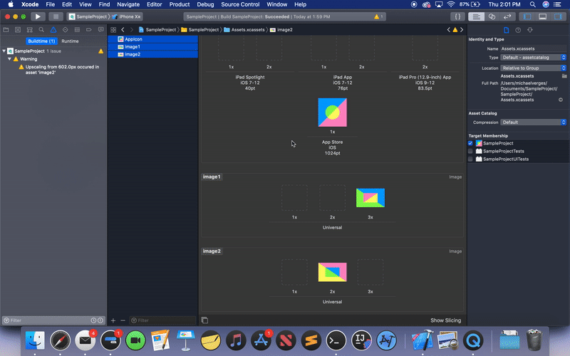

# Asset Generator

#### Xcode build phase for generating scaled assets

Xcode users know that scaling image and AppIcon assets is inefficient. Even by using tools that generate icons, precious time is spent dragging and dropping. Asset Generator is a completely automated tool that runs during your project's Build Phase. For every image and icon in .xcassets folders, Asset Generator will find the largest asset and scale it to fill any missing sizes.

## Getting Started

These instructions will show you how to implement Asset Generator as an Xcode build phase in your project.

### Adding to Xcode

1. Download scripts/* and place the files in your Xcode project's target.

2. In project settings: `YourTarget > Build Phases > + > New Run Script Phase`

3. In the Run Script Phase, enter: `$SRCROOT/YourTarget/generateAssests.sh`

4. In generateAssets.sh replace the path for AssetSpec.rb

### Using in Xcode

Build your project and assets will be generated.

>For assets, you may provide any size, but you will recieve a build warning unless the largest required scale is provided.

## Built With

* [Ruby](https://www.ruby-lang.org/)

## Contributing

The provided scripts are starting points for your own implementation. If you encounter bugs in the provided scripts, please report an issue.

If you have enhancements or feature requests, report an issue or create a pull request.

## Authors

* [**Michael Verges**](https://github.com/maustinstar) - *Initial work* - mverges3@gatech.edu
